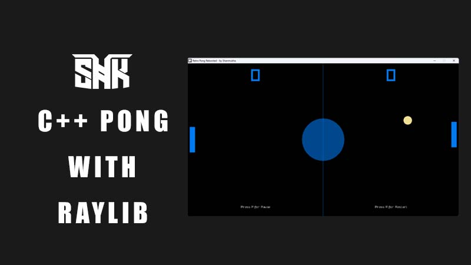

# Retro Pong Rebooted by Shanmukha🎮

  

A simple and fun remake of the classic Pong game using **C++** and **raylib**.

---

## 🚀 Features
- 🧠 Player vs CPU and Player vs Player game modes
- 🏓 Color-changing ball on paddle collision
- ⏸️ Pause and resume functionality
- 🔁 Restart game anytime
- 🏁 Game over screen when score reaches 5
- 🎨 Retro-styled main menu and game UI

---

## 🕹️ Controls

| Action              | Key(s)         |
|---------------------|----------------|
| Move P1 Up/Down     | `W` / `S`       |
| Move P2 Up/Down     | `↑` / `↓`       |
| Pause/Resume Game   | `P`             |
| Restart Game        | `R`             |
| Exit to Main Menu   | `M` (after game over) |
| Select Game Mode    | `1` or `2`      |
| Start Game          | `Space`         |
| Exit Game           | `Esc`           |

---

Enjoy the game!

-- Shanmukha
